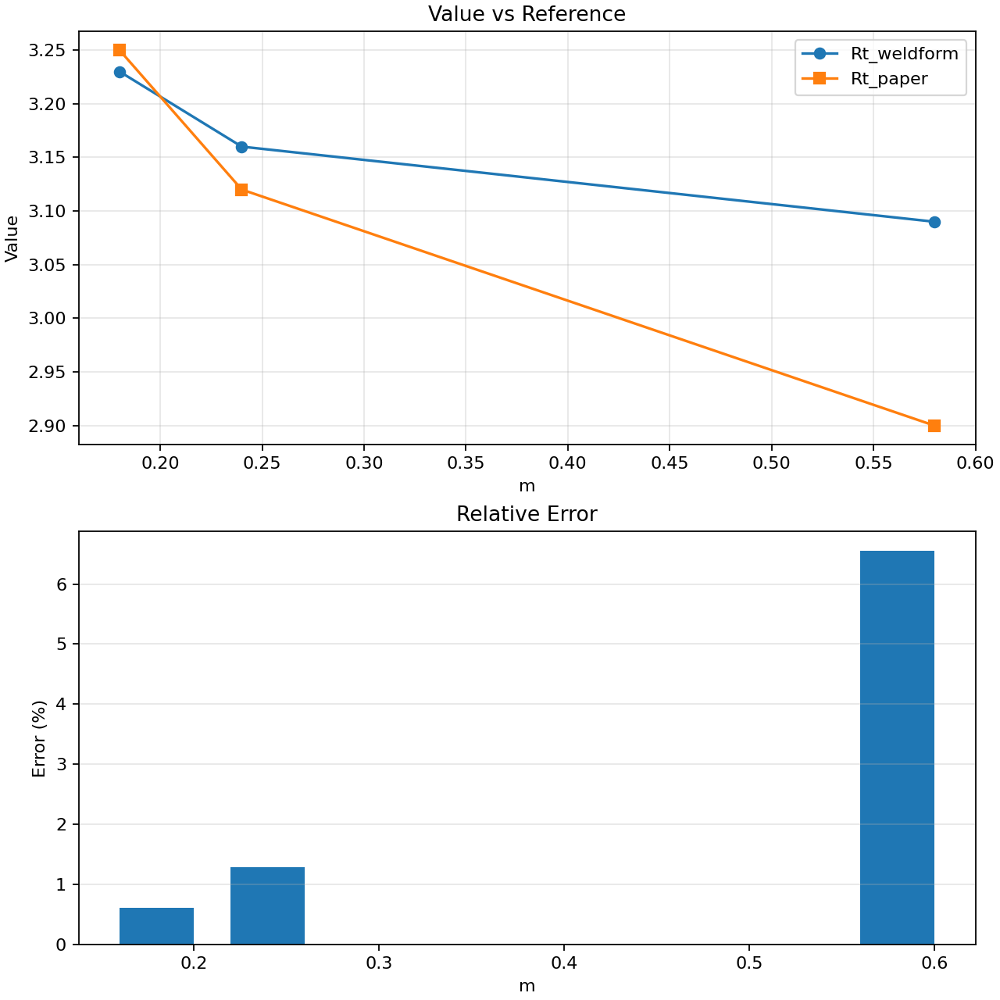

# Relative Error Report

- X column: `m`
- Value column: `Rt_weldform`
- Reference column: `Rt_paper`
- Mean relative error: `0.028164`
- Max relative error: `0.065517` at `m = 0.58`

## Plot

## HTML Table

- Table file: `shear_data_relative_error_table.html`
